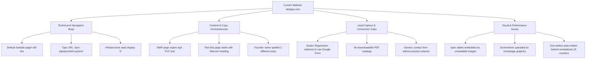

# IDOL PIPE (idolpipe.com) — Comprehensive Website Data & Current Scenario Document

**Website Analyzed:** [https://idolpipe.com/](https://idolpipe.com/)  
**Document Generation Date:** September 2026  
**Document Purpose:** Complete content extraction, site architecture mapping, product portfolio documentation, technical infrastructure audit, and strategic digital assessment of the current scenario.

---

## 1. Executive Summary & Company Profile

### 1.1 Brand & Corporate Overview
- **Brand Name:** Idol Pipe Fittings & Irrigation (IDOL)
- **Legal Corporate Entities:**
  1. **Idol Plasto Pvt. Ltd.**
  2. **Idol Polytech Pvt. Ltd.**
- **Founder & CEO:** Mr. Bhagwanji Vadodariya (also spelled Bhagvanji Vadodaria)
- **Year Established:** 1989 (30+ Years of Industry Experience)
- **Taglines & Mottos:**
  - *"We are India's one of the leading manufacturer and exporter of pipes, fittings and irrigation system"*
  - *"The Farmer's True Friend"*
  - *"Your Growth, One Happy World"*
- **Core Business Segments:**
  1. Residential, Commercial & Industrial Plumbing Systems
  2. Agricultural Pipes & Borewell Solutions
  3. Micro & Precision Irrigation Systems (Drip & Sprinkler)
  4. Cabling & Telecommunications Ducts
  5. SWR Drainage & Sewage Solutions

### 1.2 Physical Manufacturing Units & Registered Locations
1. **Unit 1 (Idol Plasto Pvt. Ltd.):**
   - **Address:** Rajkot - Ahmedabad NH - 8B, Wankaner Chokadi, Survey No. 552, Opp. Kuvadava High School, Dist: Rajkot, Kuvadva - 360023, Gujarat, India.
   - **Primary Focus:** Plumbing (cPVC, uPVC) and Sewage Systems.
   - **Direct Contacts:** `+91 92654 96492`, `+91 89807 00100` | Email: `export@idolpipe.com`, `sales@idolpipe.com`
2. **Unit 2 (Idol Polytech Pvt. Ltd.):**
   - **Address:** RK Industrial Zone-8, Wankaner - Kuwadva Chowkdi, Rajkot - Ahmedabad National Highway, At-Ranpur (Navagam), Dist: Rajkot - 360023, Gujarat, India.
   - **Primary Focus:** HDPE Pipes, Agriculture Pipes, Borewell Casing, and Irrigation Systems.
   - **Direct Contacts:** `+91 99254 55255`, `+91 97730 44163` | Email: `hdpe@idolpipe.com`

### 1.3 Infrastructure & Manufacturing Capacity
- **Facility Footprint:** 2 advanced manufacturing plants in Rajkot, Gujarat.
- **Production Capacity:** 24,000 Metric Tons (MT) per year.
- **Quality Standard:** ISO 9001:2015 certified company adhering to Indian Standards (IS), ASTM, and DIN norms.
- **Sourcing & Machinery:**
  - **Machinery:** Imported automated extrusion and molding technology from India, Germany, Italy, and Japan.
  - **Raw Materials:** 100% virgin-grade materials; 80% imported from Japan, South Korea, Taiwan, UAE, Indonesia, and Israel. Domestic raw material procurement backed by formal tie-ups with **Reliance Industries Limited**.
- **Global Export Footprint:** Products exported across 3 continents to North America, South America (including strong presence in Mexico), Europe, Southeast Asia, Middle East, and Africa.

---

## 2. Complete Website Architecture & Content Map

The website currently contains **22 core pages**, **93 blog posts**, and **24 taxonomy categories**, managed under WordPress using the Astra theme, LiteSpeed caching, and Elementor.

### 2.1 Master Page Inventory

| # | Page Title | URL Slug | Current Status / Content Focus |
|---|---|---|---|
| 1 | **Home** | `/` | Hero section, 4 primary categories, value proposition, video block, latest 3 blog posts, world export graphic. |
| 2 | **About Us** | `/about-us/` | Company history since 1989, founder vision, plant details, certifications, mission & values. |
| 3 | **Infrastructure** | `/infrastructure/` | Sourcing details, imported machinery, QA labs, capacity statistics. |
| 4 | **cPVC Hot & Cold Pipe and Fittings** | `/cpvc-hot-coldpipe-and-fittings-system/` | Chlorinated Polyvinyl Chloride pipes & fittings, temperature ratings up to 93°C, SDR 11 & SDR 13.5. |
| 5 | **uPVC Pipe & Plumbing System** | `/ipvc-pipeplumbinf-system/` | Unplasticized PVC pipes, SCH-40 & SCH-80, cold water delivery, chemical applications. *(Note URL typo)* |
| 6 | **PVC Garden Flexible Hose Pipe** | `/pvc-garden-flexble-hose-pipe/` | Soft PVC flexible hoses for gardening, car wash, residential and landscaping use. |
| 7 | **SWR Drainage System** | `/swr-drainage-system/` | Soil, Waste & Rainwater drainage pipes and push-fit ring fittings. *(Has copy-paste content error)* |
| 8 | **Agriculture PVC Pipes & Fittings** | `/agriculture-pvc-pipes-fittings/` | Selfit solvent-cement and elastomeric ring-fit pipes conforming to IS:4985. Air valve recommendations. |
| 9 | **Submersible Column & Drop/Riser Pipes** | `/submersible-column-drop-riser-pipes/` | Deep-well submersible pump riser pipes, square threads, bi-axial orientation, replacement for GI. |
| 10 | **uPVC Borehole Casing Pipes** | `/upvc-borehole-casing-pipes/` | IS 12818:1992 / 2010 deep-blue casing & screen/slotted ribbed pipes for tube wells up to 250m depth. |
| 11 | **HDPE / PLB Telecom Duct Pipe** | `/hdpe-plb-telecom-duct-pipe/` | High-density polyethylene pipes in PE 63, PE 80, PE 100 for irrigation, municipal water, and optical fiber ducts. |
| 12 | **Flat Drip Irrigation System** | `/flat-drip-irrigation-system/` | Flat drip tape dripper lines for row crops, anti-clogging emitter channels. |
| 13 | **Round Drip Irrigation System** | `/round-drip-irrigation-system/` | Cylindrical emitter drip tubing for orchards, sugarcane, vineyards, and rugged fields. |
| 14 | **Plain Drip Irrigation System** | `/plain-drip-irrigation-system/` | Blind lateral pipes without pre-inserted emitters for custom on-line button dripper placement. |
| 15 | **Rain Pipe & Accessories** | `/rain-pipe-and-accessories/` | Laser-perforated micro-spraying flexible hoses (32mm & 40mm) operating at 1.0–1.5 bar. |
| 16 | **Sprinkler Irrigation System** | `/sprinkler-irrigation-system/` | HDPE sprinkler pipes with quick-action latch couplers, heavy brass rotary nozzles, 27° trajectory. |
| 17 | **Mini Sprinkler Irrigation System** | `/mini-sprinkler-irrigation-system/` | Micro-sprinklers with compression & push fittings for tea, vegetable nurseries, orchards, and cooling. |
| 18 | **Irrigation System & Accessories** | `/irrigation-system-accessories/` | Industrial disc filters, screen filters, hydrocyclone sand separators, media filters, valves, venturis. |
| 19 | **Updates / Blog** | `/update/` | Central blog archive featuring 93 articles on agricultural engineering, winterizing, solar lines, and plumbing tips. |
| 20 | **Career** | `/career/` | Job portal currently listing full-time opening for Sales Executive in Rajkot, Gujarat. |
| 21 | **Contact Us** | `/contact-us/` | Inquiries form, departmental division phone numbers, email IDs, and social handles. |
| 22 | **Sample Page** | `/sample-page/` | Default WordPress demo page remaining online (`"Hi there! I'm a bike messenger by day..."`). |

---

## 3. Detailed Product Portfolio & Engineering Specifications

### 3.1 Plumbing & Building Water Systems

#### A. cPVC Hot & Cold Pipe & Fittings System
- **Polymer:** Chlorinated Polyvinyl Chloride (cPVC).
- **Temperature & Pressure Tolerances:**
  - Sustained hot water handling up to **93°C**.
  - Cold water sub-zero handling down to **-5°C**.
  - Maximum hydrostatic test capability up to **40 kgf/cm²**.
- **Dimension Classes:**
  - **Pipes:** 1/2" to 2" in **SDR-11** (Standard Dimension Ratio) and **SDR-13.5**.
  - **Fittings:** 3/4" to 2" in **SDR-11**.
- **Installation Advisory:** When coupling with rooftop solar water heating panels or geysers, direct CPVC attachment to the heater tank outlet is discouraged. A 1-meter metallic loop or transition nipple must precede the cPVC line to absorb excessive radiant heat buildup.
- **Key Applications:** Solar thermal piping, high-rise residential plumbing, industrial chemical fluid transit, commercial hotels, and hospitals.

#### B. uPVC Plumbing System (Cold Water)
- **Polymer:** High-grade Unplasticized Polyvinyl Chloride.
- **Schedules & Sizing:**
  - **Pipes:** 1/2" to 3" in **Schedule 40 (SCH-40)** and **Schedule 80 (SCH-80)**.
  - **Fittings:** 1/2" to 2" in **Schedule 80 (SCH-80)**.
- **Standards:** ASTM D-1785 / ASTM D-2467 equivalent.
- **Features:** 100% lead-free formulation safe for potable drinking water, 100% chlorine resistant, zero internal calcification, smooth internal bore minimizing friction loss.

#### C. PVC Garden Flexible Hose Pipe
- **Composition:** Flexible plasticized PVC resin compounded with premium plasticizers and UV stabilizers.
- **Features:** Oil-free, lightweight, high kink resistance, smooth gliding surface across stones and garden obstacles.
- **Applications:** Household landscaping, lawn care, vehicle washing, and general outdoor washdown.

---

### 3.2 Drainage & Sewage Systems

#### SWR Drainage System (Soil, Waste & Rainwater)
- **Jointing Mechanism:** Push-fit elastomeric ring sockets and Selfit solvent cement joints.
- **Standards:** IS:13592 / IS:14735 standards.
- **Advantages:** 
  - Push-fit rubber ring joint requires no adhesive solvent cement on-site.
  - 50% faster installation over conventional cast-iron or plain-ended cement pipes.
  - 100% leak-proof, non-choking smooth bore preventing grease deposition and bacterial accumulation.
- **Applications:** High-rise domestic soil & waste drainage, rainwater harvesting down-takes, industrial effluent lines.

---

### 3.3 Agricultural & Underground Water Extraction

#### A. Agriculture PVC Pipes & Fittings
- **Standards:** Conforms to **IS:4985-2000** for Potable Water Supply.
- **Joint Types:**
  - **Selfit (Solvent Joint):** One end integral socketed, opposite end chamfered plain.
  - **Ring-Fit (Elastomeric Ring Socket):** Precision-grooved socket with integrated rubber sealing ring; couplers eliminated.
- **Standard Pipe Length:** 6.0 meters (excluding socket depth).
- **Engineering Guidelines Provided by Idol:**
  - **Air Valve Rule:** Compressed air pockets within closed irrigation mains cause severe water-hammer bursts. Double-acting or single-acting kinetic air release valves sized at approximately **1/4th the main pipe diameter** must be positioned every **300 to 400 meters** along high elevation crests.
  - **Trench Specifications:** Width should be pipe outside diameter + 350mm to 400mm. Trench depth recommended at 1.0 meter minimum above crown of pipe with stone-free bedding layer.

#### B. uPVC Borehole Casing & Screen Pipes
- **Standard:** Manufactured strictly as per **IS 12818:1992 / IS 12818:2010**, equivalent to German Standard **DIN 4925**.
- **Color:** Characteristic deep royal blue.
- **Threading Types:** Trapezoidal ribbed threads or precision 'V' threads with male spigot and female socket. Protective transit caps attached.
- **Classifications & Depths:**
  - **Shallow Well (C.S.):** Depths up to 80 meters.
  - **Medium Well (C.M.):** Depths up to 250 meters.
- **Screen / Slotted Variations:** Horizontal precision slots engineered for groundwater intake and silt retention. Extensively deployed in storm-water percolation pits, municipal rainwater recharging wells, and soakways.

#### C. Submersible Column & Drop/Riser Pipes
- **Function:** Heavy-duty vertical riser pipes suspending submersible borehole pumps.
- **Material Performance:** Completely eliminates corrosion, scale incrustation, and galvanic electrolysis typical of GI and Mild Steel pipes.
- **Efficiency:** Produces **10% to 30% higher water discharge** due to frictionless internal surface, lowering pump electricity draw.
- **Installation:** High-torque leak-proof square threaded joints; eliminates need for on-site welding or solvent cement.

---

### 3.4 Telecommunications & Heavy Infrastructure

#### HDPE / PLB Telecom Duct Pipes
- **Polymer Grades:** PE 63, PE 80, and PE 100 high-density polyethylene.
- **Packaging:** Flexible continuous coils ranging from **50 meters to 500 meters**, as well as 6-meter rigid bars.
- **PLB Technology:** Permanently Lubricated (PLB) inner silicone lining for high-speed fiber-optic cable blowing with minimal friction.
- **Applications:** Optical fiber cable (OFC) conduits, cross-country water transmission, municipal sewage, and industrial slurry handling.

---

### 3.5 Micro & Precision Irrigation Systems

#### A. Drip Irrigation Systems
- **Flat Drip Tape:** Integrated flat emitter labyrinth with turbulent flow path preventing clogging; optimized for closely spaced row crops (cotton, vegetables, sugarcane, potatoes).
- **Round Drip Tubing:** Cylindrical drippers welded inside 12mm / 16mm thick-walled tubing for multi-season orchards, fruit crops, and uneven terrains.
- **Plain Laterals (Blind Pipe):** Virgin LDPE/LLDPE flexible tubing without perforations for customized punch insertion of online pressure-compensating or non-PC drippers.

#### B. Rain Pipe System
- **Profile:** Laser-punched flexible flat hose manufactured in **32mm and 40mm** outer diameters.
- **Operating Pressure:** Low pressure operation at **1.0 Bar – 1.5 Bar**.
- **Performance:** Emits uniform fine spray mist mimicking natural rainfall. Replaces heavy metal sprinklers with up to 90% reduction in equipment weight and cost.

#### C. Sprinkler Systems
- **Sprinkler Pipes:** Quick-connect HDPE pipes with welded male/female latches and rubber seal rings.
- **Rotary Sprinkler Nozzle Heads:**
  - Durable cast brass body, brass arm, and heavy brass nut.
  - Stainless steel pivot pin and recoil springs.
  - **Trajectory Angle:** 27° trajectory for maximum wind resistance.
  - **Inlet:** 3/4" BSP / NPT male thread.
  - **Operating Pressure:** 1.0 – 3.0 kg/cm² with coverage spacing up to 15 meters.
- **Mini Sprinklers:** Complete micro-irrigation packages with compression take-off adapters, 90° tee couplings, male adapters, punches, and u-openers.

#### D. Filtration Units & Automation Hardware
- **Disc Filters:** DuPont nylon hybrid clamp with stainless steel toggle lock; disc cartridge equipped with internal directional helix generating centrifugal spin.
- **Screen Filters:** Dual stainless steel SS-316 mesh (30 & 120 mesh) rated up to 6 bar operating pressure.
- **Hydrocyclone Sand Separators:** Polypropylene vortex cone separating heavy suspended silt and sand into an 8L or 10L bottom collector tank before reaching downstream drippers.
- **Media Sand Filters:** Multi-layer silica quartz sand battery for biological and algae filtration from open canals and farm ponds.
- **Control Valves:** True-union PVC ball valves (PN 16 rating), Kaveri PP ball valves (PN 6 rating), wafer-type PVC butterfly valves, air release valves (automatic kinetic vacuum breakers operating at 7–175 PSI), and dial pressure gauges.

---

## 4. Current Scenario Audit: Deficiencies, Flaws & Gaps

While Idol Pipe demonstrates manufacturing capabilities, deep product depth, and active content production, the current website exhibits critical technical bugs, layout defects, and structural omissions that damage credibility and conversion rates.

### 4.1 Critical Technical Bugs & Broken Endpoints
1. **Live WordPress Boilerplate Page (`/sample-page/`):**
   - The default WordPress placeholder page is still publicly accessible and indexed by search engines. It displays dummy text: *"Hi there! I'm a bike messenger by day, aspiring actor by night... XYZ Doohickey Company..."*
2. **Permanent URL Typos in Product Hierarchy:**
   - The primary uPVC plumbing product URL is misspelled as: `https://idolpipe.com/ipvc-pipeplumbinf-system/` (`ipvc` instead of `upvc`, and `plumbinf` instead of `plumbing`). This breaks SEO URL credibility and keyword value.
3. **Broken / Zero-Value Animated Counters in Infrastructure:**
   - On `https://idolpipe.com/infrastructure/`, the dynamic counter widgets have failed to initialize in HTML or were left unpopulated:
     - Manufacturing Units: **0**
     - National Depots: **0**
     - Land Area (sq. meters): **0**
     - Production Capacity (MT/month): **0**
     - Products: **0+** | Distributors: **0+** | Customers: **0+**
   - This makes the factory appear empty or out of business to visiting commercial buyers.

### 4.2 Content Integrity & Copy-Paste Errors
1. **SWR Drainage System Page Mislabeled:**
   - On `https://idolpipe.com/swr-drainage-system/`, the introductory body paragraph was accidentally duplicated verbatim from the agricultural pipe page: *"We offer Agriculture PVC Pipes & Fittings. The Selfit (Solvent Cement Joint) pipes have one end self-socketed..."*
2. **Flat Drip Page Header Mismatch:**
   - On `https://idolpipe.com/flat-drip-irrigation-system/`, an erroneous sub-headline *"HDPE/PLB Telecom duct pipe"* appears right above the drip irrigation copy.
3. **Inconsistent Founder & Entity Spelling:**
   - On the About Us page, the founder is referred to as **Mr. Bhagwanji Vadodariya** in the main body text, but signed as **Mr. Bhagvanji Vadodaria** under his sign-off title.
   - The facility area states *"spans over 450 square meters"* which is likely a typographical mistake for 45,000 sq. meters, given a 24,000 MT capacity.

### 4.3 UI/UX, SEO & Catalog Deficiencies
1. **Technical Data Trapped in Raster Images:**
   - Critical pipe dimension charts, wall thicknesses, and pressure tables are uploaded as static raster image graphics (e.g., `Round-Drip-12mm-OD-Table.webp` and raw Windows screenshots like `Screenshot-2026-06-05-135752.png`). 
   - **Impact:** Search engines cannot crawl the specs, screen readers cannot parse them, and mobile users cannot zoom in cleanly on tiny numbers.
2. **Absence of Downloadable Product Catalogs:**
   - Industrial B2B buyers, EPC contractors, and international distributors rely on downloadable PDF specification sheets and price lists. The site has **zero downloadable PDF catalogs**.
3. **Third-Party Dealer Registration Leak:**
   - Clicking "Dealer Registration" in the main navigation sends the prospective partner away from `idolpipe.com` to an unbranded generic Google Form (`docs.google.com/forms/d/...`), degrading the enterprise brand perception and forfeiting analytics tracking.

---

## 5. Contact Points & Channel Audit

| Channel | Recorded Value | Evaluation / Status |
|---|---|---|
| **Plumbing / SWR Sales** | `+91 92654 96492` / `+91 89807 00100` | Working Indian mobile lines |
| **Agriculture / HDPE Sales** | `+91 99254 55255` / `+91 97730 44163` | Working Indian mobile lines |
| **Export Email** | `export@idolpipe.com` | Active domain email |
| **HDPE / Agri Email** | `hdpe@idolpipe.com` | Active domain email |
| **General Sales Email** | `sales@idolpipe.com` | Active domain email |
| **Skype ID Listed** | `export.idol` | Legacy VOIP handle |
| **WhatsApp Chat Widget** | Integrated floating modal | Direct routing to plumbing & agriculture teams |
| **YouTube** | `https://www.youtube.com/@idolpipes8517/` | Official channel linked |
| **LinkedIn** | `idol-plasto-private-limited` | Company page linked |
| **Facebook & Instagram** | `@idolpipe` | Active social profiles |

---

## 6. Strategic Modernization Roadmap & Recommendations

To transform `idolpipe.com` into a modern digital platform matching its 24,000 MT industrial capacity, the following phased upgrades are recommended:

### Phase 1: Urgent Hygiene & Content Fixes (Within 48 Hours)
- [ ] Delete or redirect `/sample-page/` with a 410 Gone or 301 redirect.
- [ ] Correct the URL typo `/ipvc-pipeplumbinf-system/` to `/upvc-plumbing-pipes-fittings/` and implement a 301 redirect.
- [ ] Fix the SWR Drainage page copy by replacing the misplaced agriculture pipe text with proper SWR drainage technical descriptions.
- [ ] Correct the sub-heading on the Flat Drip page to remove the telecom duct text.
- [ ] Fix the infrastructure counters: hardcode fallback values (e.g. 2 Manufacturing Units, 24,000 MT capacity, 45,000+ sq. m area) so they never render as "0".

### Phase 2: B2B Lead Conversion & Catalog Engine
- [ ] **On-Site Dealer Portal:** Replace the external Google Form with an on-page, multi-step interactive Dealer & Distributor Application Form with city/state auto-complete, warehouse capacity fields, and direct CRM integration.
- [ ] **Downloadable Resource Center:** Create formatted, downloadable technical PDF brochures and submittal sheets for every product category (cPVC, uPVC, SWR, Casing, Drip, Sprinkler).
- [ ] **Dynamic Product Specification Tables:** Convert all graphic/screenshot tables into responsive HTML tables with sorting, search, and metric/imperial unit toggle.

### Phase 3: Global Expansion & Multilingual SEO
- [ ] Implement multi-lingual switching (English, Spanish, and French) with dedicated sub-directories (`/es/`) to capitalize on existing export traction in Latin America (Mexico) and Africa.
- [ ] Embed structured schema markup (`Product`, `Organization`, `Manufacturer`, `FAQPage`) on every category page to dominate Google snippets for "CPVC pipe exporter India" and "IS 12818 casing pipe manufacturer".
